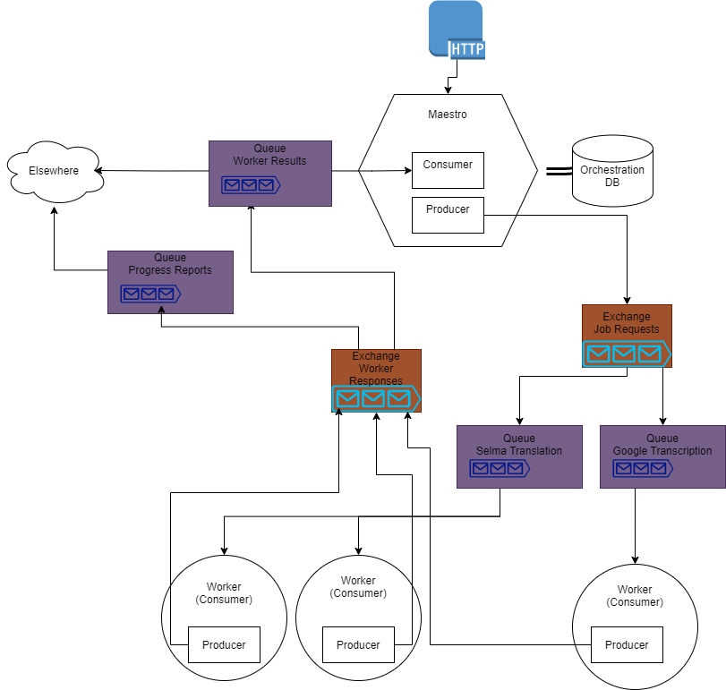

# Orchestration Server

Given a graph with the jobs as nodes and the dependencies as (directed) edges, this project maximizes the opportunity to run jobs in parallel, whilst ensuring each job has the necessary input. Furthermore, it provides a framework for the development of autonomous workers that handles the communication necessary for the aforementioned purpose.

## Projects

This repository contains the following components:

- C# Project `maestro` is the entity that:
    - receives a HTTP request (the graph);
    - orchestrates the communication with and the indirect communication between workers;
    - reads from and writes to the orchestration-db.

- C# Project `orchestration-db` persists the state of each job:
  - Status;
  - Workflow;
  - Dependencies;
  - Type;
  - Provider;
  - Request (JSON to be sent to the Worker);
  - Result (JSON received from the Worker).
  - Scripts (optional JSON with JS scripts to mutate the Request and/or Result)

- C# Project `worker-template` is the framework to easily develop workers.
- C# Project `worker-example`is a worker that leverages the worker-template to invert a string.
- C# Project `worker-rest` is a generic worker that calls a REST API using HTTP details injected in the message payload.
- C# Project `worker-js` is a generic worker that executes JavaScript source embedded in the message payload. (more information and examples [here](worker-js/README.md))

- A RabbitMQ instance.
- A(n optional) Postgres instance.

Try it out via [swagger](http://localhost:10000/swagger/index.html), after running `docker-compose up` (or `docker compose up --force-recreate` to recreate the DB). An example test data can be found [here](./maestro/TestData/1provider2nodes.json).
To test it with multiple workflow requests, execute `./multiple_curl_test.sh` after running `docker-compose up`. Test data for the Maestro and TokenQueue (https://github.com/SELMA-project/selma-v8) integration can be found [here](./maestro/TestData/5TokenQueueNMT.json). Test data for Maestro, TokenQueue, Gourmet, JavaScript integration can be found [here](./maestro/TestData/6TokenQueueJavascript.json).



## Development Helpers

- Open Orchestration UI
  - `cd maestro-orchestration\orchestration-ui`
  - `dotnet run`

- Example RabbitMQ payload input

```json
{
  "Type": 4,
  "Payload": {
   "Details": {
      "Script": ""
    }
  },
  "JobId": "379d53e6-862a-494f-a021-a01f9c19f1c"
}
```
